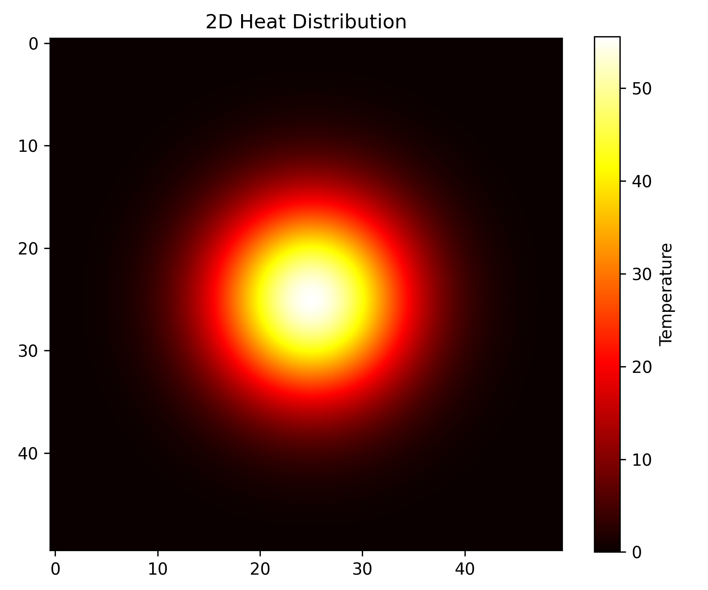
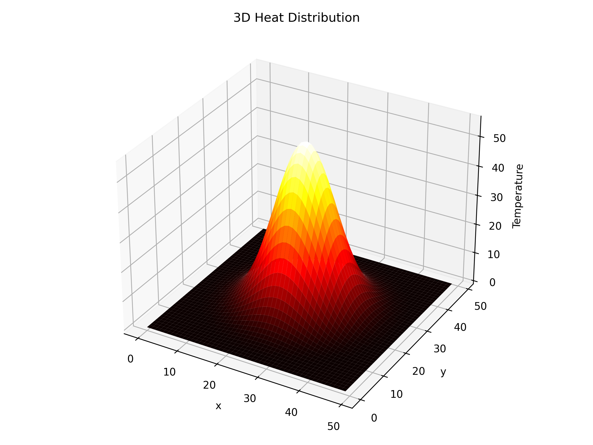
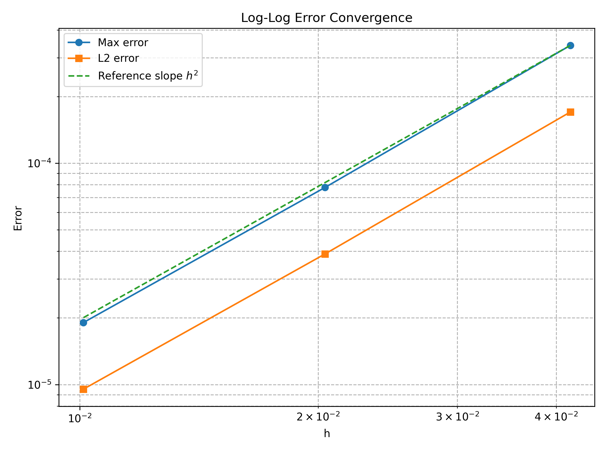

# 2D Heat Equation Solver

A Python-based project for solving the two-dimensional heat equation using the explicit finite difference method.  
This project includes numerical simulation, 2D and 3D visualization, comparison with an exact solution, and convergence analysis.

---

## 1. Mathematical Model

The equation considered in this project is:

$$
u_t = \alpha (u_{xx} + u_{yy})
$$

where:

- $u(x,y,t)$ is the temperature distribution
- $\alpha$ is the thermal diffusivity

This equation describes the diffusion of heat in a two-dimensional domain.

---

## 2. Numerical Method

The solver uses the **explicit finite difference method**.

For interior grid points, the update formula is:

$$
u_{i,j}^{n+1} = u_{i,j}^n + \alpha \Delta t \left( \frac{u_{i+1,j}^n - 2u_{i,j}^n + u_{i-1,j}^n}{\Delta x^2} + \frac{u_{i,j+1}^n - 2u_{i,j}^n + u_{i,j-1}^n}{\Delta y^2} \right)
$$

This method is simple and efficient, but it requires a stability condition on the time step.
---

## 3. Features

- Explicit finite difference solver for the 2D heat equation
- Gaussian initial condition simulation
- 2D heatmap visualization
- 3D surface plot visualization
- Comparison between numerical and exact solutions
- Error field visualization
- Mesh refinement and convergence study

---

## 4. Project Structure

```text
heat-equation-solver/
│
├─ main.py
├─ solver.py
├─ error_analysis.py
├─ README.md
│
├─ figures/
│  ├─ gaussian_2d.png
│  ├─ heat_3d.png
│  └─ convergence_plot.png
│
└─ results/
   └─ convergence_table.txt
```

- `main.py`: runs the Gaussian heat diffusion simulation and generates 2D/3D plots
- `solver.py`: contains the core finite difference update step
- `error_analysis.py`: computes convergence orders and plots the log-log error curve
- `figures/`: stores generated images
- `results/`: stores convergence tables

---

## 5. How to Run

Run the simulation:

```bash
python main.py
```

Run the convergence analysis:

```bash
python error_analysis.py
```

---

## 6. Numerical Experiments

### Gaussian Initial Condition

A Gaussian heat source is used as an initial condition:

$$
u(x,y,0)=A\exp\left(-\frac{(x-x_0)^2+(y-y_0)^2}{2\sigma^2}\right)
$$

This produces a smooth temperature peak that diffuses outward over time.

### Exact Solution for Validation

For error analysis, the following exact solution is used:

$$
u(x,y,t)=e^{-2\pi^2\alpha t}\sin(\pi x)\sin(\pi y)
$$

This allows direct comparison between the numerical solution and the analytical solution.

---

## 7. Results

The numerical experiments show that:

- the numerical solution agrees well with the exact solution
- the error decreases as the mesh is refined
- both the maximum error and the $L^2$ error exhibit approximately second-order convergence

Typical convergence orders observed in this project are close to 2.

---

## 8. Sample Output

### 2D Heat Distribution



### 3D Heat Distribution



### Convergence Plot



---

## 9. Future Improvements

Possible extensions of this project include:

- implicit Euler method
- Crank–Nicolson scheme
- Neumann boundary conditions
- animation export as GIF
- interactive parameter control

---

## 10. Conclusion

This project demonstrates how the 2D heat equation can be solved numerically using Python and the explicit finite difference method.

It combines mathematical modeling, numerical analysis, visualization, and error verification in a compact and structured implementation.
